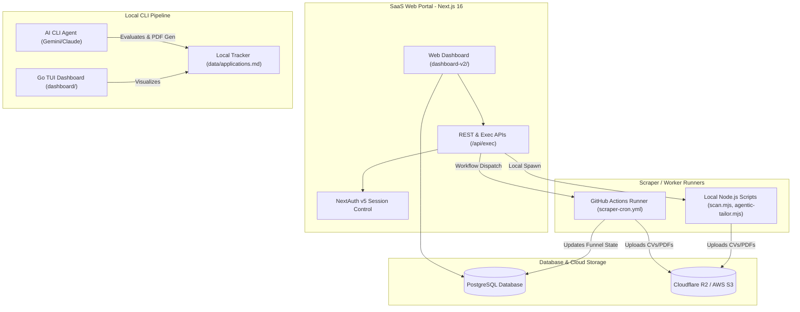

# Career-Ops: Standalone AI Job Search & SaaS Command Center

Companies use AI to filter candidates. **Career-Ops gives candidates the AI infrastructure to target and secure their next role.** 

This repository is a fully standalone, bifurcated edition of Career-Ops featuring a local-first CLI pipeline integrated with a multi-tenant Next.js SaaS dashboard, Go TUI dashboard, cloud storage synchronization, and distributed scraper automation.

---

<p align="center">
  <strong>Evaluate job offers · Customize CVs · Track your pipeline · SaaS Hub</strong>
</p>

<p align="center">
  <a href="https://github.com/UGilfoyle/career-ops/releases/latest"></a>
  <a href="https://github.com/UGilfoyle/career-ops"></a>
</p>

---

## 🏗️ System Architecture

Career-Ops bridges local-first CLI workflows and Go terminal interfaces with a full-stack cloud Next.js SaaS platform.



### Core Operations Flow
1. **Scraper Job Dispatch**: Users trigger scans from [dashboard-v2](file:///Users/akashkaintura/Desktop/career-ops/dashboard-v2). The API invokes workflow runs in GitHub Actions or locally spawns [scan.mjs](file:///Users/akashkaintura/Desktop/career-ops/scan.mjs).
2. **Zero-Token ATS Scans**: The engine fetches job postings directly from Greenhouse, Lever, and Ashby JSON APIs, bypassing heavy Playwright requirements for list scanning.
3. **AI Evaluation & Cascade**: [agentic-tailor.mjs](file:///Users/akashkaintura/Desktop/career-ops/agentic-tailor.mjs) processes descriptions using a try-catch model cascade (defaulting to MiniMax, falling back to Qwen) to generate markdown reports and custom CV layouts.
4. **Data Sync**: Reports are cataloged in [data/applications.md](file:///Users/akashkaintura/Desktop/career-ops/data/applications.md), and generated resume PDFs are compiled via Playwright and synced to Cloudflare R2 or AWS S3 buckets.

---

## 🛠️ Bifurcation & Standalone Customizations

To enable custom feature sets and separate the pipeline from upstream updates, the following modifications were completed:

* **Standalone System Updater**: Reconfigured [update-system.mjs](file:///Users/akashkaintura/Desktop/career-ops/update-system.mjs) to target `UGilfoyle/career-ops` for tags, releases, and changelog updates.
* **Go Module Isolation**: Refactored the dashboard module in [go.mod](file:///Users/akashkaintura/Desktop/career-ops/dashboard/go.mod) and updated package import routes in all `.go` files under the [dashboard](file:///Users/akashkaintura/Desktop/career-ops/dashboard) folder to use the dedicated repository path.
* **Metadata & Licensing**: Replaced all upstream references with standalone configurations across [package.json](file:///Users/akashkaintura/Desktop/career-ops/package.json), [CITATION.cff](file:///Users/akashkaintura/Desktop/career-ops/CITATION.cff), [SECURITY.md](file:///Users/akashkaintura/Desktop/career-ops/SECURITY.md), [GOVERNANCE.md](file:///Users/akashkaintura/Desktop/career-ops/GOVERNANCE.md), and [SUPPORT.md](file:///Users/akashkaintura/Desktop/career-ops/SUPPORT.md).
* **Funding & Branding Cleanup**: Removed upstream `.github/FUNDING.yml` configuration and purged sponsorship widgets to align the repository strictly under personal ownership.

---

## ⚡ Tech Stack

| Component | Technology | Description |
| :--- | :--- | :--- |
| **SaaS Hub (`dashboard-v2`)** | Next.js 16, React 19, Tailwind CSS | Multi-tenant visual dashboard with Server-Side Rendering (SSR). |
| **SaaS Auth / Database** | NextAuth v5, PostgreSQL | Session persistence and relational application funnel tracking. |
| **Cloud Assets** | AWS SDK, Cloudflare R2 / S3 | Storage for generated PDF resumes and customized cover letters. |
| **Terminal TUI (`dashboard`)** | Go 1.24, Bubble Tea, Lipgloss | Fast, interactive CLI dashboard with keyboard navigation. |
| **Static Web Dashboard** | Node.js, Express (`web-dashboard`) | Lightweight, self-contained single-page browser pipeline. |
| **Engine / Scrapers** | Node.js 20+, Playwright | Zero-token direct-API scanners and headless compilers. |
| **AI Processing** | OpenAI-Compatible LLM Cascade | Fail-safe pipeline defaulting to MiniMax and falling back to Qwen. |

---

## 💾 Data Contract & Separation of Concerns

To prevent system updates from overwriting custom CV data or settings, Career-Ops maintains a strict barrier between layers:

### 👤 User Layer (Never modified by system updates)
* **[cv.md](file:///Users/akashkaintura/Desktop/career-ops/cv.md)**: The canonical source-of-truth markdown resume.
* **[config/profile.yml](file:///Users/akashkaintura/Desktop/career-ops/config/profile.yml)**: Personal parameters (name, target roles, salary range).
* **[modes/_profile.md](file:///Users/akashkaintura/Desktop/career-ops/modes/_profile.md)**: User-specific scoring metrics, keywords, and narratives.
* **[data/applications.md](file:///Users/akashkaintura/Desktop/career-ops/data/applications.md)**: The raw markdown tracking spreadsheet.
* **[portals.yml](file:///Users/akashkaintura/Desktop/career-ops/portals.yml)**: Scraper configuration target companies and job filters.

### ⚙️ System Layer (System code & engine defaults)
* Node.js scripts (`scan.mjs`, `agentic-tailor.mjs`, `merge-tracker.mjs`).
* All files in `modes/` (except `_profile.md`).
* Templates folder (`templates/cv-template.html`, `templates/states.yml`).

---

## 🚀 Quick Start

### 1. Installation & Environment Setup
Clone the repository and install the dependencies:
```bash
git clone https://github.com/UGilfoyle/career-ops.git
cd career-ops

npm install
npx playwright install chromium # Needed for PDF compilation
```

### 2. Verify Your Configuration
Run the cold-start check script to ensure all user files are placed properly:
```bash
npm run doctor
```
If this is your first run, the system will guide you through onboarding steps to create [cv.md](file:///Users/akashkaintura/Desktop/career-ops/cv.md) and [config/profile.yml](file:///Users/akashkaintura/Desktop/career-ops/config/profile.yml).

### 3. Launching Dashboard Portals

#### Option A: Next.js SaaS Web Dashboard (Premium)
```bash
cd dashboard-v2
pnpm install
pnpm dev
```
Navigate to `http://localhost:3000` to access the multi-tenant web application.

#### Option B: Go Terminal TUI Dashboard (Developer)
```bash
cd dashboard
go build -o career-dashboard .
./career-dashboard --path ..
```

#### Option C: Lightweight Static Dashboard (Minimalist)
```bash
cd web-dashboard
node server.mjs
```
Navigate to `http://localhost:8080`.

---

## 📂 Repository Layout

```
career-ops/
├── AGENTS.md                    # Agent behavior guidelines
├── CLAUDE.md                    # Claude CLI run configurations
├── dashboard-v2/                # Next.js 16 Full-Stack SaaS Dashboard
├── dashboard/                   # Go Bubble Tea TUI
├── web-dashboard/               # Lightweight static Express dashboard
├── modes/                       # AI prompt templates & evaluation workflows
├── templates/                   # HTML/LaTeX templates & keyword profiles
├── config/                      # User configuration profiles (gitignored)
├── data/                        # Active application logs & database outputs (gitignored)
├── reports/                     # Sequential markdown evaluations (gitignored)
└── output/                      # Generated tailored PDF resumes (gitignored)
```

---

## ⚖️ Ethics, License & Disclaimer

* **Ethics**: Career-Ops values high-quality matches. **Never auto-submit applications** without a human review. Discourage low-score matches, and respect recruiter review cycles.
* **Disclaimer**: You are responsible for your data, your deployment, and rate-limit compliance when accessing external job portal APIs.
* **License**: MIT License. See [LICENSE](file:///Users/akashkaintura/Desktop/career-ops/LICENSE) for the full text. Trademark guidelines can be reviewed in [TRADEMARK.md](file:///Users/akashkaintura/Desktop/career-ops/TRADEMARK.md).
