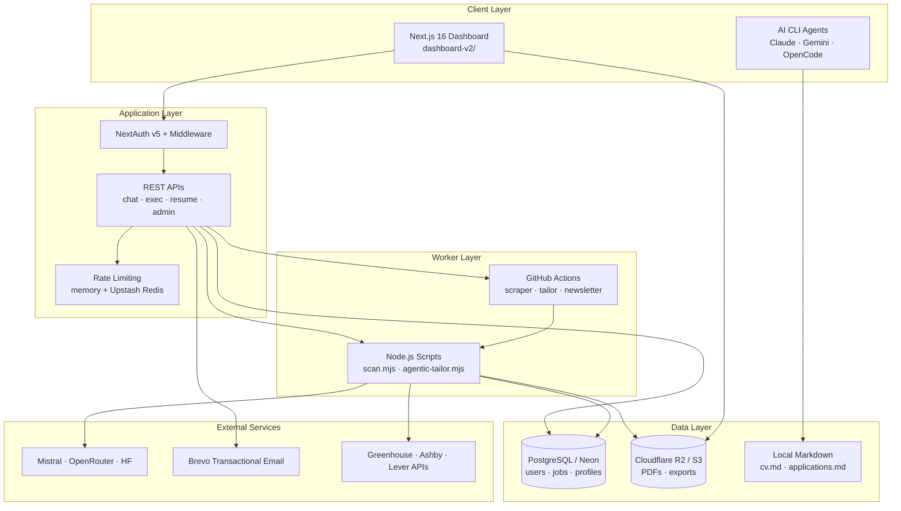

<p align="center">
  
</p>

<h1 align="center">Career-Ops</h1>

<p align="center">
  <strong>Enterprise-grade AI career infrastructure for candidates who play offense.</strong><br/>
  Evaluate offers · Tailor resumes · Run your pipeline · Ship applications — from one command center.
</p>

<p align="center">
  <a href="https://careerops.dpdns.org"></a>
  <a href="https://github.com/UGilfoyle/career-ops/releases/latest"></a>
  <a href="LICENSE"></a>
  <a href="https://nodejs.org"></a>
</p>

<p align="center">
  <a href="#-platform">Platform</a> ·
  <a href="#-architecture">Architecture</a> ·
  <a href="#-security">Security</a> ·
  <a href="#-quick-start">Quick Start</a> ·
  <a href="#-deployment">Deployment</a> ·
  <a href="#-cli--automation">CLI & Automation</a>
</p>

---

## The problem

Recruiters use AI to filter you. **Career-Ops gives you the same class of infrastructure on your side** — not another job board, not a generic resume builder, but a full-stack system that evaluates roles against your real profile, generates ATS-ready documents, and keeps your pipeline auditable.

Built as a **local-first CLI** with an optional **multi-tenant SaaS layer**. Your data stays yours. The engine stays sharp.

---

## Platform

<table>
<tr>
<td width="50%" valign="top">

### Career Copilot
Mistral-powered AI chat with full profile context — outreach drafts, interview prep, skill-gap analysis, and role-specific advice. OpenRouter fallback chain included.

### Resume Studio
Live ATS preview, JD match scoring, section-based editor, template gallery, and one-click PDF export with cloud caching (R2/S3).

### Saved tailored docs
Re-open generated resumes and PDFs without re-running the pipeline. Per-job storage in PostgreSQL + object storage.

</td>
<td width="50%" valign="top">

### Pipeline intelligence
Kanban tracker, offer scoring (A–F blocks), portal scanning across Greenhouse / Ashby / Lever, and GitHub Actions workers for heavy jobs.

### Enterprise auth & security
NextAuth v5 (GitHub + credentials), email verification, login lockout, API rate limits, optional Cloudflare Turnstile, security headers.

### Admin & growth
Admin user registry, visitor analytics, referral codes, monthly product newsletters from DB (no Brevo contact lists required).

</td>
</tr>
</table>

| Capability | Detail |
|:---|:---|
| **Zero-token scanning** | Direct ATS API hits — no browser for list scans |
| **Agentic tailoring** | LLM-driven resume + cover letter per job description |
| **PDF pipeline** | Playwright + ATS HTML templates → R2/Neon cache |
| **Multi-tenant** | Per-user `user_id` scoping across jobs, profiles, exports |
| **Mobile-ready** | Responsive dashboard, safe-area layouts, touch-friendly studio |
| **GDPR-minded** | Local-first data contract, exportable markdown tracker, human-in-the-loop apply |

> **v3 highlight:** Copilot · Resume Studio · saved docs · security hardening · `careerops.dpdns.org`

---

## Architecture



### Request flow (typical tailor job)

1. User adds a job URL or ID in the dashboard terminal (`/api/exec`).
2. API authenticates, rate-limits, and dispatches GitHub Actions or spawns `agentic-tailor.mjs`.
3. Worker fetches the JD, scores fit against `cv.md` + profile, writes a report, and generates tailored HTML/PDF.
4. Artifacts land in `reports/`, the DB tracker, and R2 — visible in **Generated Docs** and **Resume Studio**.

---

## Security

Career-Ops is built for production SaaS, not a weekend side project.

| Control | Implementation |
|:---|:---|
| **Authentication** | JWT sessions, bcrypt (cost 12), email verification before login |
| **Brute-force protection** | Per-IP + per-email login limits, 15-min lockout after 5 failures |
| **OTP hardening** | Per-email verify limits and wrong-code lockout |
| **API quotas** | Copilot, terminal exec, and PDF export rate limits per user |
| **Bot mitigation** | Optional Cloudflare Turnstile on signup/login |
| **Transport & headers** | `X-Frame-Options`, `X-Content-Type-Options`, `Referrer-Policy` |
| **Multi-tenancy** | All job/profile/resume queries scoped by `user_id` |
| **Secrets** | Env-only API keys — never committed |

Distributed rate limiting: set `UPSTASH_REDIS_REST_URL` + `UPSTASH_REDIS_REST_TOKEN` on Vercel for shared limits across serverless instances.

---

## Tech stack

| Layer | Stack |
|:---|:---|
| **Frontend** | Next.js 16, React 19, Tailwind CSS 4, Framer Motion |
| **Auth** | NextAuth v5 (GitHub OAuth + credentials) |
| **Database** | PostgreSQL (Neon) — users, jobs, profiles, newsletter sends |
| **Object storage** | Cloudflare R2 / AWS S3 — PDFs, master exports |
| **Email** | Brevo transactional API — OTP, password reset, newsletters |
| **AI** | Mistral (primary Copilot), OpenRouter, Hugging Face (optional) |
| **PDF** | Playwright + `@sparticuz/chromium-min` on Vercel |
| **Workers** | GitHub Actions — scraper cron, tailor dispatch, monthly newsletter |
| **CLI engine** | Node.js 22 `.mjs` scripts — scan, evaluate, merge, verify |

---

## Quick start

### Prerequisites

- Node.js **22.x**
- PostgreSQL (or [Neon](https://neon.tech) for SaaS)
- Optional: Brevo API key, R2 bucket, Mistral/OpenRouter keys

### 1. Clone & install

```bash
git clone https://github.com/UGilfoyle/career-ops.git
cd career-ops
npm install
npx playwright install chromium
```

### 2. Onboarding

```bash
npm run doctor
```

Creates `cv.md`, `config/profile.yml`, `portals.yml`, and `data/applications.md` if missing.

### 3. Launch the dashboard

```bash
cd dashboard-v2
npm install
npm run dev
```

Open **http://localhost:3000** — sign up, verify email, upload your CV, run your first scan.

### 4. CLI (optional)

Works with any [Agent Skills](https://agentskills.io)-compatible CLI:

```bash
node scan.mjs                    # Portal scan
node agentic-tailor.mjs <job-id> # Tailor resume for a job
node merge-tracker.mjs           # Sync tracker additions
```

---

## Deployment

Production runs on **Vercel** with a custom domain (`careerops.dpdns.org`).

### Core environment variables

| Variable | Purpose |
|:---|:---|
| `DATABASE_URL` | Neon PostgreSQL connection string |
| `AUTH_SECRET` | NextAuth JWT signing |
| `AUTH_GITHUB_ID` / `AUTH_GITHUB_SECRET` | GitHub OAuth |
| `NEXTAUTH_URL` / `APP_URL` | `https://careerops.dpdns.org` |
| `BREVO_API_KEY` / `BREVO_SENDER_EMAIL` | Transactional email |
| `MISTRAL_API_KEY` | Career Copilot (primary) |
| `OPENROUTER_API_KEY` | LLM fallback chain |
| `R2_*` or `AWS_*` | PDF object storage |
| `ADMIN_EMAILS` / `ADMIN_PASSWORD` | Admin panel access |
| `UPSTASH_REDIS_REST_*` | Shared rate limits (recommended) |

### GitHub Actions secrets

Same `DATABASE_URL`, `BREVO_*`, `APP_URL`, and `AUTH_SECRET` for:

- **Scraper cron** — scheduled portal scans
- **Monthly newsletter** — 2nd of each month, 09:00 UTC
- **Product update newsletter** — manual `workflow_dispatch`

Newsletters pull recipients from **your database** (`newsletter_opt_in = true`, verified email). No Brevo contact list setup required.

```bash
npm run newsletter:dry          # Monthly digest dry run
npm run newsletter:release:dry  # Product update dry run
```

---

## CLI & automation

| Command | What it does |
|:---|:---|
| `npm run scan` | Zero-token portal scan |
| `npm run doctor` | Onboarding / health check |
| `npm run merge` | Merge tracker TSV additions |
| `npm run verify` | Pipeline integrity check |
| `npm run newsletter` | Send monthly email to DB users |

**AI CLI integration:** paste a job URL in Claude Code, OpenCode, or Gemini CLI with `/career-ops` — full evaluate → report → PDF → tracker pipeline.

---

## Data contract

Your data and system code are strictly separated so updates never overwrite your profile.

**User layer (never auto-updated by system releases)**

| File | Role |
|:---|:---|
| `cv.md` | Canonical resume |
| `config/profile.yml` | Identity, targets, comp |
| `modes/_profile.md` | Archetypes, narrative, scoring weights |
| `data/applications.md` | Application tracker |
| `portals.yml` | Scanner companies & filters |
| `reports/`, `output/` | Evaluations & PDFs |

**System layer (updated by `npm run update`)**

Scripts in `*.mjs`, prompt modes in `modes/`, templates in `templates/`, dashboard in `dashboard-v2/`.

See [DATA_CONTRACT.md](DATA_CONTRACT.md) for the full list.

---

## Repository layout

```
career-ops/
├── dashboard-v2/              # Next.js SaaS — auth, copilot, resume studio, admin
│   └── src/content/           # Release notes (landing + newsletter source)
├── modes/                     # AI evaluation & pipeline prompts
├── templates/                 # ATS CV HTML/LaTeX templates
├── .github/workflows/         # Scraper cron, newsletters, CI
├── scan.mjs                   # Zero-token portal scanner
├── agentic-tailor.mjs         # LLM resume tailoring worker
├── newsletter-monthly.mjs     # Monthly DB → Brevo newsletter
├── newsletter-product-update.mjs
├── data/                      # Tracker & pipeline (user data)
└── reports/                   # Evaluation reports (user data)
```

---

## Compliance & responsible use

- **Human-in-the-loop:** AI drafts applications — you review and submit. No blind auto-apply in production.
- **Truthfulness:** Scoring cites your real CV lines. No invented metrics.
- **GDPR-friendly design:** Local-first option, markdown export, opt-out newsletters, no third-party analytics baked in.
- **Quality over volume:** System discourages low-fit applications (score &lt; 4.0/5).

---

## Contributing

Issues and PRs welcome. See [CONTRIBUTING.md](CONTRIBUTING.md), [CODE_OF_CONDUCT.md](CODE_OF_CONDUCT.md), and [GOVERNANCE.md](GOVERNANCE.md).

CI runs `test-all.mjs` on every PR. Branch protection on `main`.

---

## Author

Built by **[Akash Kaintura](https://github.com/UGilfoyle)**.

<p align="center">
  <a href="https://careerops.dpdns.org/signup"><strong>Get started free →</strong></a>
</p>

---

## License

[MIT](LICENSE) — use it, fork it, make it yours.
