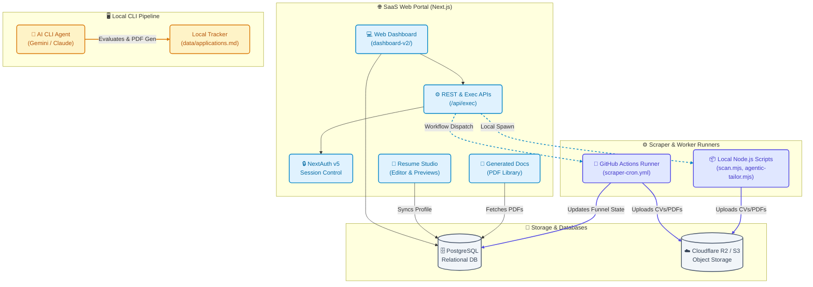

# Career-Ops: Standalone AI Job Search & SaaS Command Center

Companies use AI to filter candidates. **Career-Ops gives candidates the AI infrastructure to target and secure their next role.** 

This repository is a standalone edition of Career-Ops featuring a local-first CLI pipeline integrated with a private full-stack Next.js SaaS dashboard, cloud storage synchronization, and scheduled scraper automation.

---

<p align="center">
  <strong>Evaluate job offers · Customize CVs · Track your pipeline · SaaS Hub</strong>
</p>

<p align="center">
  <a href="https://github.com/UGilfoyle/career-ops/releases/latest"></a>
  <a href="https://github.com/UGilfoyle/career-ops"></a>
</p>

---

## 🏗️ System Architecture

Career-Ops bridges local-first CLI workflows with a full-stack Next.js SaaS platform.



### Core Operations Flow
1. **Scraper Job Dispatch**: Users trigger scans from the web dashboard. The API invokes workflow runs in GitHub Actions or locally spawns `scan.mjs`.
2. **Zero-Token ATS Scans**: The engine fetches job postings directly from Greenhouse, Lever, and Ashby JSON APIs, bypassing heavy Playwright requirements for list scanning.
3. **AI Evaluation & Cascade**: `agentic-tailor.mjs` processes descriptions using your configured LLM (e.g., GPT-4o-mini, Gemini, or Claude) to generate markdown reports, tailored resumes, and custom cover letters.
4. **Data Sync**: Reports are cataloged in `data/applications.md` and synced to your database. PDF resumes are compiled via Playwright and synced to your private Cloudflare R2 or AWS S3 bucket.

---

## 🇪🇺 EU Compliance & Data Privacy (GDPR)

Career-Ops is engineered with privacy-by-design principles fully compliant with the European Union General Data Protection Regulation (GDPR):

* **Local-First & Private Storage:** All candidate Personally Identifiable Information (PII) including your CV, contact details, salary expectations, and application history is stored locally on your machine or inside your own private database/cloud storage.
* **No Telemetry or Third-Party Tracking:** This repository does not contain any analytic trackers, cookies, or remote reporting mechanisms. We collect zero data.
* **Data Portability:** Your application funnel is stored in standard Markdown (`data/applications.md`) and TSV formats, allowing you to export or delete your entire history instantly.

### EU AI Act & Transparency Compliance
In accordance with the EU AI Act guidelines regarding artificial intelligence assistance:
* **Human-in-the-Loop Enforced:** AI evaluations and resume tailoring are strictly advisory. **Never auto-submit job applications.** A human must review and manually click send on every application.
* **Transparency:** Custom resumes clearly state achievements derived from your real career facts. The system prevents cross-job metrics hallucination to ensure truthfulness to recruiters.

---

## ⚡ Tech Stack

| Component | Technology | Description |
| :--- | :--- | :--- |
| **SaaS Hub (`dashboard-v2`)** | Next.js 16, React 19, Tailwind CSS | Multi-tenant visual dashboard with Server-Side Rendering (SSR). |
| **SaaS Auth / Database** | NextAuth v5, PostgreSQL | Session persistence and relational application funnel tracking. |
| **Cloud Assets** | AWS SDK, Cloudflare R2 / S3 | Storage for generated PDF resumes and customized cover letters. |
| **Engine / Scrapers** | Node.js 20+, Playwright | Zero-token direct-API scanners and headless PDF compilers. |
| **AI Processing** | OpenAI-Compatible LLM | Target job evaluation, match scoring, and resume tailoring. |

---

## 💾 Data Contract & Separation of Concerns

To prevent system updates from overwriting custom CV data or settings, Career-Ops maintains a strict barrier between layers:

### 👤 User Layer (Never modified by system updates)
* **`cv.md`**: The canonical source-of-truth markdown resume.
* **`config/profile.yml`**: Personal parameters (name, target roles, salary range, cover letter layout preferences).
* **`modes/_profile.md`**: User-specific scoring metrics, keywords, and narratives.
* **`data/applications.md`**: The raw markdown tracking spreadsheet.
* **`portals.yml`**: Scraper configuration target companies and job filters.

### ⚙️ System Layer (System code & engine defaults)
* Node.js scripts (`scan.mjs`, `agentic-tailor.mjs`, `merge-tracker.mjs`, `resume-quality.mjs`).
* Prompt templates inside `modes/` (e.g. `oferta.md`, `pdf.md`, `scan.md`).
* Document layouts inside `templates/` (`templates/cv-template.html`, `templates/states.yml`).

---

## 🚀 Quick Start (Easy Use)

### 1. Installation & Environment Setup
Clone the repository and install the dependencies:
```bash
git clone https://github.com/UGilfoyle/career-ops.git
cd career-ops

npm install
npx playwright install chromium # Needed for PDF resume compilation
```

### 2. Run Onboarding Check
Run the cold-start check script to configure your profile and template:
```bash
npm run doctor
```
If this is your first run, the system will guide you through onboarding steps to create `cv.md` and `config/profile.yml`.

### 3. Launch the Web Dashboard
```bash
cd dashboard-v2
pnpm install
pnpm dev
```
Navigate to `http://localhost:3000` to access the multi-tenant web application.

---

## 📂 Repository Layout

```
career-ops/
├── AGENTS.md                    # Agent behavior guidelines
├── CLAUDE.md                    # Claude CLI run configurations
├── dashboard-v2/                # Next.js Full-Stack SaaS Dashboard
├── modes/                       # AI prompt templates & evaluation workflows
├── templates/                   # HTML templates & keyword profiles
├── config/                      # User configuration profiles (gitignored)
├── data/                        # Active application logs & database outputs (gitignored)
├── reports/                     # Sequential markdown evaluations (gitignored)
├── output/                      # Generated tailored PDF resumes (gitignored)
└── interview-prep/              # Accumulated STAR+R interview story banks (gitignored)
```

---

## ⚖️ License

MIT License. See [LICENSE](file:///Users/akashkaintura/Desktop/career-ops/LICENSE) for the full text.
