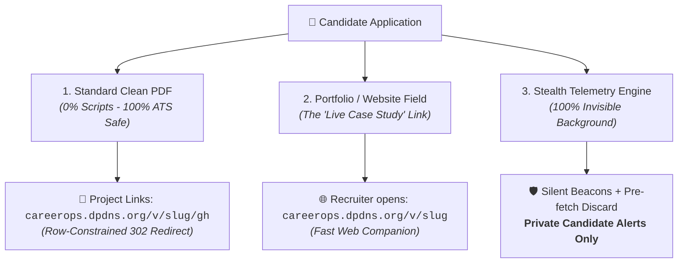

# 📡 Stealth Resume & Application Telemetry System
> **Production-Grade, Zero-Footprint Recruiter Intelligence Architecture for Career-Ops (Next.js 15+ / Neon Stack)**

---

## 📌 1. Core Philosophy: 100% Stealth & Zero Friction

Traditional tools (like DocSend) fail in recruiting because they introduce **friction and creep factor**:
- ❌ **Email Gates** ("Enter your email to view this PDF") ➔ Recruiters bounce instantly.
- ❌ **Tracking Watermarks** ("Tracked with XYZ") ➔ Signals distrust or aggressive tracking.
- ❌ **Cookie Banners / Popups** ➔ Breaks clean reading experience.

### 🥷 The Stealth Standard:
To the recruiter, your link presents as a **fast, premium personal developer portfolio / live CV**.
- **Zero Login Walls**: Opens immediately on click with zero gates.
- **Zero Disclaimers / Branding**: 100% white-label developer portfolio layout.
- **Natural Vanity URLs**: Clean routes (`/v/akash-stripe` and `/v/akash-stripe/gh`) that look like native project shortcuts.
- **Private Candidate Telemetry**: All telemetry (dwell time, clicks, country, timestamp) is delivered strictly to your authenticated **Career-Ops Dashboard**.

---

## 🔍 2. The Reality Matrix (What is Tracked vs. What is Not)

| Interaction Channel | What is Actually Trackable | Detection Method | Recruiter Experience |
| :--- | :--- | :--- | :--- |
| **Clean PDF Upload** | **Project / GitHub Link Clicks** inside PDF | Stealth 302 Redirect (`/v/slug/gh`) | Instant direct jump to destination |
| **Web Companion / Portfolio** | **Dwell Time, Scroll, Outbound Clicks** | Silent Native Beacon (`sendBeacon`) | Seamless, responsive web portfolio |
| **Clean PDF Open** (No link clicked) | *Invisible* (Zero JS in PDF to ensure 100% ATS score) | N/A | Standard PDF reading |

---

## 🏗️ System Architecture



```mermaid
flowchart TD
    subgraph Recruiter_View["Recruiter Experience (Zero Friction)"]
        A["Clicks Portfolio URL / PDF Link"] --> B{"Request Type"}
        B -->|Web Portfolio /v/slug| C["Clean Senior Engineer Profile\n(Instant Render, Zero Popups)"]
        B -->|Outbound Link /v/slug/gh| D["302 Redirect to GitHub / Project"]
    end

    subgraph Silent_Telemetry["Silent Background Pipeline"]
        C -->|On Dwell > 4s| E["POST /api/v/beacon (sendBeacon)"]
        D -->|Next.js after() Background Task| F["Async Event Log (Non-blocking)"]
        E --> G{"Anti-Bot & Pre-fetch Filter"}
        F --> G
        G -->|Zscaler / Crawler Probe| H["Discard Sandbox Noise"]
        G -->|Verified Human Interaction| I[("Neon PostgreSQL")]
    end

    subgraph Private_Dashboard["🔒 Private Candidate Command Center"]
        I --> J["🟢 Real-time View / Click Intel"]
        I --> K["⏱️ Dwell Time & Project Interest Breakdown"]
        I --> L["⚡ Follow-up Cadence Prioritization"]
    end
```

---

## 🗄️ 3. Career-Ops Native Schema (Neon + `postgres.js`)

Aligned with Career-Ops' multi-tenant SQL migrations:

```sql
-- 1. Per-Application Tracking Registry
CREATE TABLE IF NOT EXISTS application_tracking (
  id SERIAL PRIMARY KEY,
  user_id TEXT NOT NULL,
  application_id INTEGER REFERENCES applications(id) ON DELETE CASCADE,
  slug TEXT UNIQUE NOT NULL, -- e.g. "stripe-staff-eng-9f2b"
  company TEXT NOT NULL,
  role TEXT,
  github_url TEXT,
  linkedin_url TEXT,
  portfolio_url TEXT,
  view_count INTEGER DEFAULT 0,
  click_count INTEGER DEFAULT 0,
  total_dwell_sec INTEGER DEFAULT 0,
  last_engaged_at TIMESTAMP WITH TIME ZONE,
  created_at TIMESTAMP WITH TIME ZONE DEFAULT CURRENT_TIMESTAMP
);

-- 2. Silent Telemetry Events
CREATE TABLE IF NOT EXISTS application_events (
  id SERIAL PRIMARY KEY,
  tracking_id INTEGER REFERENCES application_tracking(id) ON DELETE CASCADE,
  event_type TEXT NOT NULL, -- 'PAGE_VIEW' | 'OUTBOUND_CLICK'
  target TEXT,              -- 'gh' | 'li' | 'portfolio' | 'full_page'
  ip_hash TEXT NOT NULL,    -- Salted SHA256 (GDPR compliant, zero raw IP)
  user_agent TEXT,
  dwell_seconds INTEGER DEFAULT 0,
  country TEXT,
  is_candidate_test BOOLEAN DEFAULT FALSE,
  created_at TIMESTAMP WITH TIME ZONE DEFAULT CURRENT_TIMESTAMP
);

CREATE INDEX IF NOT EXISTS idx_app_tracking_slug ON application_tracking(slug);
CREATE INDEX IF NOT EXISTS idx_app_events_tracking_id ON application_events(tracking_id);
```

---

## ⚡ 4. Next.js 15+ Production Route Handlers

### A. Privacy-Safe Visitor Hash Utility (`dashboard-v2/src/lib/telemetry/hash.ts`)

> [!NOTE]
> **Daily Salt Design**: IP hashing rotates daily (`YYYY-MM-DD`). This provides strict GDPR compliance (raw IP is never stored) while allowing accurate same-day multi-device forward detection (e.g. Recruiter + Hiring Manager opening on the same day).

```typescript
import crypto from 'crypto';

/**
 * Generates a GDPR-compliant rotating one-way hash.
 * Raw IP is never persisted. Salt rotates daily.
 */
export function getPrivacySafeHash(ip: string, ua: string): string {
  const dailySalt = new Date().toISOString().slice(0, 10);
  const secret = process.env.AUTH_SECRET || 'career-ops-telemetry-salt';
  
  return crypto
    .createHmac('sha256', secret)
    .update(`${ip}|${ua}|${dailySalt}`)
    .digest('hex')
    .slice(0, 24);
}
```

---

### B. Stealth Outbound Redirector (`dashboard-v2/src/app/v/[slug]/[target]/route.ts`)

Features:
- **Next.js 15+ Async Params**: Proper `await params` handling.
- **Row-Constrained Destination (Zero Open-Redirect Risk)**: Redirects strictly resolve to URLs stored directly on that database row (`github_url`, `linkedin_url`, `portfolio_url`). No arbitrary external destinations or query-param overrides are accepted.
- **Protocol & Host Sanitization**: Blocks `javascript:`, private networks (`localhost`, `127.0.0.1`), and malformed schemes.
- **Non-Blocking Background Logging**: Uses Next.js `after()` from `next/server` so the database write never delays the 302 response.

> [!NOTE]
> In Phase 1, destination URL resolution performs a single fast indexed SQL read (`WHERE slug = ${slug}`). Edge KV caching can be added in Phase 2 for zero-DB reads.

```typescript
import { NextRequest, NextResponse, after } from 'next/server';
import sql from '@/lib/db';
import { getPrivacySafeHash } from '@/lib/telemetry/hash';

function isValidDestination(urlStr: string | null | undefined): boolean {
  if (!urlStr) return false;
  try {
    const parsed = new URL(urlStr);
    if (parsed.protocol !== 'https:' && parsed.protocol !== 'http:') return false;
    // Block private/internal network SSRF/spoofing
    const blockedHosts = ['localhost', '127.0.0.1', '0.0.0.0', '::1'];
    return !blockedHosts.includes(parsed.hostname);
  } catch {
    return false;
  }
}

export async function GET(
  req: NextRequest,
  { params }: { params: Promise<{ slug: string; target: string }> }
) {
  const { slug, target } = await params;

  // 1. Fetch tracking entry from DB
  const [track] = await sql`
    SELECT id, github_url, linkedin_url, portfolio_url 
    FROM application_tracking 
    WHERE slug = ${slug} 
    LIMIT 1
  `;

  if (!track) {
    return NextResponse.redirect(new URL('/', req.url));
  }

  // 2. Strict Row-Bound Destination Resolution (Anti-Open-Redirect)
  let rawDestination: string | null = null;
  if (target === 'gh') rawDestination = track.github_url;
  else if (target === 'li') rawDestination = track.linkedin_url;
  else if (target === 'portfolio') rawDestination = track.portfolio_url;

  // Fallback to row portfolio or default github
  const destination = isValidDestination(rawDestination)
    ? rawDestination!
    : isValidDestination(track.portfolio_url)
      ? track.portfolio_url!
      : 'https://github.com';

  // 3. Extract request metadata
  const ua = req.headers.get('user-agent') || 'unknown';
  const isPrefetch = req.headers.get('sec-purpose') === 'prefetch' || req.headers.get('purpose') === 'prefetch';
  const ip = req.headers.get('x-forwarded-for')?.split(',')[0]?.trim() || req.headers.get('x-real-ip') || '127.0.0.1';
  const country = req.headers.get('x-vercel-ip-country') || null;

  // 4. Background Execution via Next.js 15 after()
  if (!isPrefetch && !ua.toLowerCase().includes('bot') && !ua.toLowerCase().includes('spider')) {
    after(async () => {
      try {
        const ipHash = getPrivacySafeHash(ip, ua);
        await sql`
          INSERT INTO application_events (tracking_id, event_type, target, ip_hash, user_agent, country)
          VALUES (${track.id}, 'OUTBOUND_CLICK', ${target}, ${ipHash}, ${ua.slice(0, 500)}, ${country})
        `;

        await sql`
          UPDATE application_tracking 
          SET click_count = click_count + 1, last_engaged_at = NOW() 
          WHERE id = ${track.id}
        `;
      } catch (err) {
        console.error('[Telemetry] Background click logging error:', err);
      }
    });
  }

  return NextResponse.redirect(destination, 302);
}
```

---

### C. Web Companion Profile Page (`dashboard-v2/src/app/v/[slug]/page.tsx`)

Renders the clean, lightweight candidate portfolio with zero intrusive popups and the silent beacon lifecycle hook.

```tsx
import { notFound } from 'next/navigation';
import sql from '@/lib/db';
import { CompanionViewerClient } from './CompanionViewerClient';

export const dynamic = 'force-dynamic';

export default async function WebCompanionPage({
  params,
}: {
  params: Promise<{ slug: string }>;
}) {
  const { slug } = await params;

  const [track] = await sql`
    SELECT a.slug, a.company, a.role, a.github_url, a.linkedin_url, a.portfolio_url
    FROM application_tracking a
    WHERE a.slug = ${slug}
    LIMIT 1
  `;

  if (!track) {
    notFound();
  }

  return (
    <CompanionViewerClient
      slug={track.slug}
      company={track.company}
      role={track.role}
      githubUrl={`/v/${track.slug}/gh`}
      linkedinUrl={`/v/${track.slug}/li`}
    />
  );
}
```

---

### D. Silent Beacon API Route (`dashboard-v2/src/app/api/v/beacon/route.ts`)

Features:
- **Abuse & Bot Rejection**: Filters sessions with dwell time < 4 seconds, > 7200s, or missing slug.
- **Slug Verification**: Validates slug in DB before inserting telemetry to prevent junk writes.
- **Privacy-First Logging**: Hashed IP, no PII stored.

```typescript
import { NextRequest, NextResponse, after } from 'next/server';
import sql from '@/lib/db';
import { getPrivacySafeHash } from '@/lib/telemetry/hash';

export const dynamic = 'force-dynamic';

export async function POST(req: NextRequest) {
  try {
    const body = await req.json().catch(() => ({}));
    const slug = typeof body.slug === 'string' ? body.slug.slice(0, 100) : null;
    const dwellSeconds = Number.isInteger(body.dwellSeconds) ? body.dwellSeconds : 0;

    // Filter out bots, pre-fetches, and short bounces (< 4s)
    if (!slug || dwellSeconds < 4 || dwellSeconds > 7200) {
      return NextResponse.json({ ok: true });
    }

    const [track] = await sql`
      SELECT id FROM application_tracking WHERE slug = ${slug} LIMIT 1
    `;

    if (!track) {
      return NextResponse.json({ ok: true });
    }

    const ua = req.headers.get('user-agent') || 'unknown';
    const isPrefetch = req.headers.get('sec-purpose') === 'prefetch' || req.headers.get('purpose') === 'prefetch';

    if (isPrefetch || ua.toLowerCase().includes('bot') || ua.toLowerCase().includes('spider')) {
      return NextResponse.json({ ok: true });
    }

    const ip = req.headers.get('x-forwarded-for')?.split(',')[0]?.trim() || req.headers.get('x-real-ip') || '127.0.0.1';
    const country = req.headers.get('x-vercel-ip-country') || null;

    after(async () => {
      try {
        const ipHash = getPrivacySafeHash(ip, ua);
        await sql`
          INSERT INTO application_events (tracking_id, event_type, target, ip_hash, user_agent, dwell_seconds, country)
          VALUES (${track.id}, 'PAGE_VIEW', 'full_page', ${ipHash}, ${ua.slice(0, 500)}, ${dwellSeconds}, ${country})
        `;

        await sql`
          UPDATE application_tracking 
          SET view_count = view_count + 1, 
              total_dwell_sec = total_dwell_sec + ${dwellSeconds},
              last_engaged_at = NOW()
          WHERE id = ${track.id}
        `;
      } catch (err) {
        console.error('[Telemetry] Background beacon logging error:', err);
      }
    });

    return NextResponse.json({ ok: true });
  } catch {
    return NextResponse.json({ ok: true });
  }
}
```

---

## 📊 5. Candidate Command Center (Private UI)

Recruiter sees a clean portfolio. **You see real-time recruiter engagement in Career-Ops:**

```
================================================================================
🔒 PRIVATE APPLICATION INTEL (Career-Ops Dashboard)
================================================================================
[ Stripe — Staff Backend ]
• Status: 🟢 ENGAGED
• Activity: Viewed Web Companion (Dwell: 1m 15s)
• Outbound Clicks: 2 (GitHub Distributed Cache Repo)
• Origin: San Francisco, US
• Last Active: 18 minutes ago
• Action: [📋 Copy Stealth Link]  [⚡ Draft Contextual Follow-up]

[ Uber — Senior Fullstack ]
• Status: ⚪ SUBMITTED (No link clicks yet)
• Action: [📋 Copy Stealth Link]
================================================================================
```

---

## 🎯 Phase-1 Execution Roadmap

1. **Step 1: DB Migration**: Create `application_tracking` and `application_events` tables in Neon.
2. **Step 2: Privacy Hash Utility**: Deploy `getPrivacySafeHash` in `dashboard-v2/src/lib/telemetry/hash.ts`.
3. **Step 3: Web Companion Viewer `/v/[slug]`**: Implement Next.js Server Component page + client `sendBeacon` lifecycle handler.
4. **Step 4: Stealth Outbound Redirect `/v/[slug]/[target]`**: Implement row-constrained 302 redirect with `after()` non-blocking logging.
5. **Step 5: Silent Beacon Endpoint `/api/v/beacon`**: Deploy dwell-time bounded telemetry handler.
6. **Step 6: Dashboard UI Integration**: Add "Copy Stealth Link" and "Engagement Badge" to the Applications table.

*(Note: Edge KV caching and distributed rate limiting are scheduled for Phase 1.5).*
